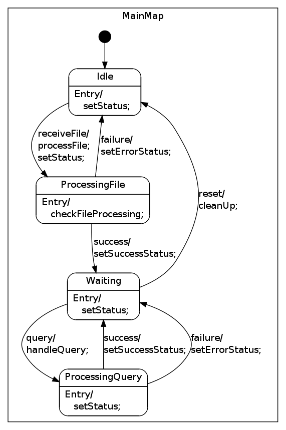

State Machine
=============

Prerequisites:
--------------

-	SMC : (http://smc.sourceforge.net/)[http://smc.sourceforge.net/]
-	Java 

Generate the state machine:
--------------

**Files**:
- The state machine definition: handler.sm
- The state machine generation: handler_sm.py
- The state machine action code (to be coded!): handler.py

```
export SMC_FOLDER=$HOME/smc

#generate the state machine class *_sm.py
java -jar $SMC_FOLDER/bin/Smc.jar -python handler.sm

export PYTHONPATH=$PYTHONPATH:$SMC_FOLDER/lib/Python

#To test:
python test.py

```

Generate Graphviz Plot
-----------

```
java -jar $SMC_FOLDER/bin/Smc.jar -graph -glevel 1 handler.sm

# convert to png
dot handler_sm.dot -Tpng -ohandler_sm.png

```



 